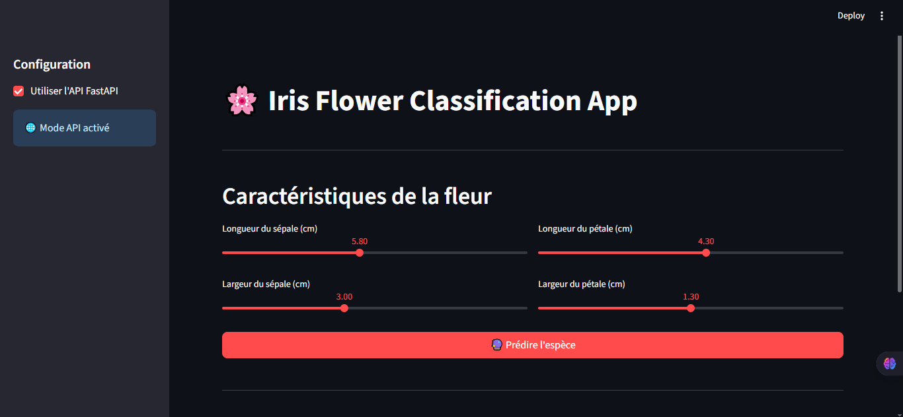
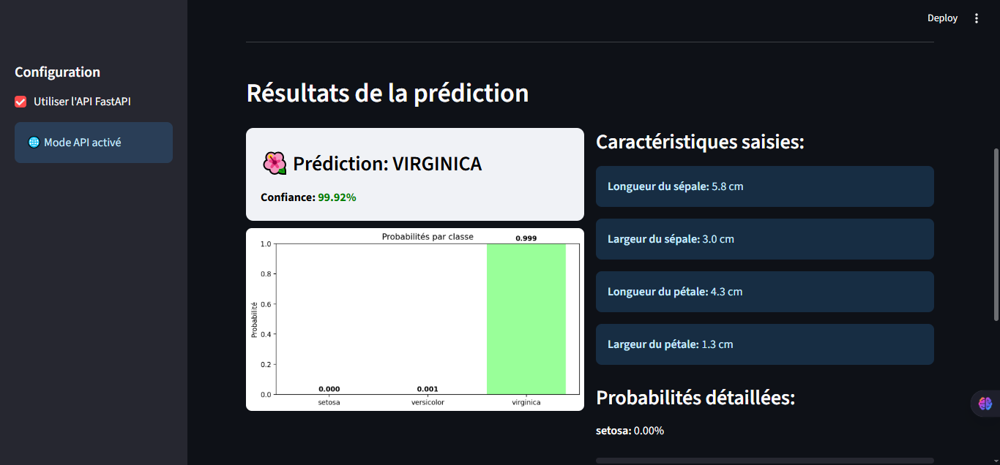

# Iris Flowers Classification

[](https://www.python.org/downloads/)
[](https://pytorch.org/)
[](https://fastapi.tiangolo.com/)
[](https://streamlit.io/)
[](https://opensource.org/licenses/MIT)
[](https://huggingface.co/)
[](https://render.com/)

A complete machine learning system for classifying iris flowers using a Multi-Layer Perceptron (MLP) neural network implemented with PyTorch. The project includes a trained model, a FastAPI backend, and a Streamlit frontend—all deployed and accessible online.




## ✨ Features

- **Machine Learning Model**: MLP classifier trained on the classic Iris dataset
- **RESTful API**: FastAPI backend with comprehensive endpoints
- **Web Interface**: Interactive Streamlit UI for real-time predictions
- **Cloud Deployment**: Fully deployed on modern platforms:
  - Model hosted on Hugging Face
  - API deployed on Render
  - UI deployed on Streamlit Cloud

## 🚀 Live Demos

- **Web Interface**: [Streamlit App](https://iris-flowers-project.streamlit.app/)
- **Model Repository**: [Hugging Face Model](https://huggingface.co/jospin6/iris-classification)

## 🛠️ Tech Stack

- **Machine Learning**: PyTorch, Scikit-learn, Pandas, NumPy
- **Backend**: FastAPI, Uvicorn, Pydantic
- **Frontend**: Streamlit
- **Deployment**: Hugging Face Hub, Render, Streamlit Cloud
- **Environment Management**: Pipenv

## 📦 Getting Started

### Prerequisites

- Python 3.8 or higher
- Pipenv (recommended) or pip

### Installation

1. **Clone the repository**
   ```bash
   git clone https://github.com/your-username/iris-flowers.git
   cd iris-flowers

2. **Install dependencies with Pipenv**
    ```bash
    pip install -r requirements.txt

### Running Locally

1. **Start the API server**
    ```bash
    cd api
    uvicorn main:app --reload --host 0.0.0.0 --port 8000

2. **Start the Streamlit app**
    ```bash
    cd frontend
    streamlit run app.py